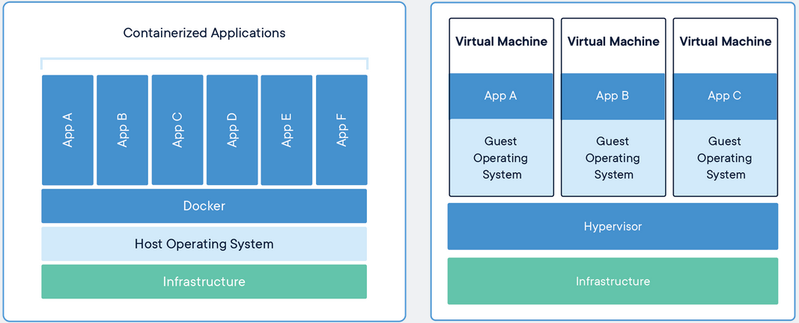

# Docker e Kubernetes

O objetivo deste repositório é trazer uma breve explicação do funcionamento do Docker e do Kubernetes a partir de explanações teoricas e exemplos práticos.

## Namespaces

Namespaces é uma funcionalidade adicionada aos sistemas linux a partir da [versão 2.6.24 do kernel](https://mirrors.edge.kernel.org/pub/linux/kernel/v2.6/). O objetivo dessa funcionalidade é promover isolamento e otimização de uso de recursos da máquina e com isso permitir o uso de diferentes versões de um mesmo software rodando de forma concorrente sem entrar em conflito.

Esse nível de isolamento pode ser atingido utilizando os namespaces em conjunto com o `chroot`, operação que altera o diretório root para àquele processo que esta rodando no momento. Esta operação garante que o programa em execução não possa acessar arquivos ou rodar comandos fora do seu diretório root.

Existem diversos sistemas valendo-se do uso de namespaces para aplicações comerciais e pessoais: [Heroku](https://www.heroku.com/), [Drone Automate Software Build and Testing](https://www.drone.io/), [Flatpak](https://flatpak.org/), [Snap principalmente no ubuntu](https://snapcraft.io/) e o [Docker](https://www.docker.com/get-started)

Portanto, o Container é uma abstração sobre o esses namespaces e o Docker a interface para interagir com os namespaces.

## Container vs VMs

Rodar aplicações em VMs cria um excesso de alocação de recursos, pois estamos literalmente subindo um novo sistema operacional, com seus processos e aplicações, virtualizando apenas a parte de hardware. No caso dos containers, o próprio sistema operacional é virtualizado, eliminando toda a alocação necessária para subir um sistema operacional inteiro. Com essa virtualização do SO, o container tem seu tamanho significativamente reduzido e irá rodar somente a aplicação alocada nele.

> Observação: Cada container hospedado numa máquina pode rodar qualquer SO compatível com o kernel do Hosting SO, no entanto, a versão do kernel não pode ser alterada, visto que o container não carrega essa informação consigo.

Próxima seção: Docker